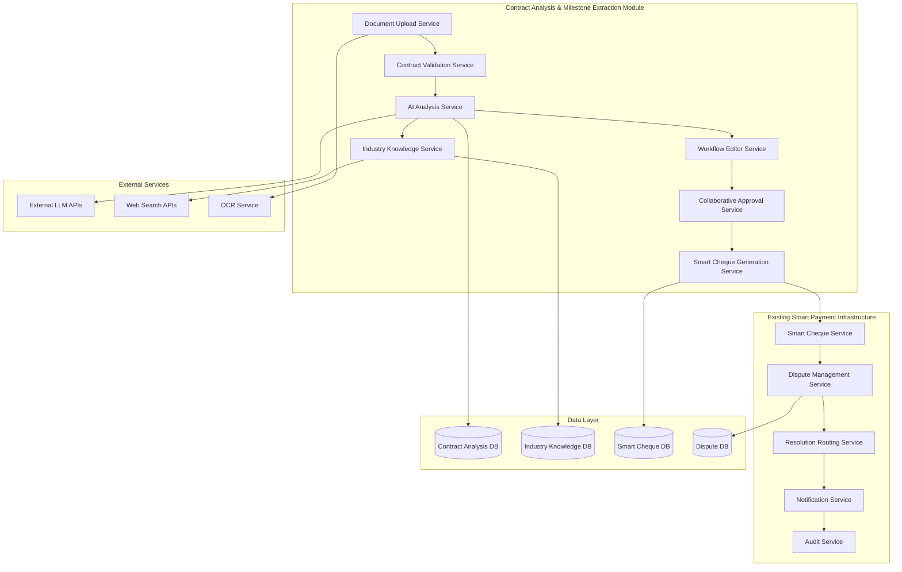

# Design Document

## Overview

The Contract Analysis and Milestone Extraction system is a standalone microservice built with clean architecture principles that automatically analyzes uploaded contracts between buyers and sellers to extract contractual obligations, create milestone-based payment workflows, and generate Smart Cheque configurations. The system leverages external LLMs, maintains an industry-specific knowledge database, and provides collaborative workflow editing capabilities through REST APIs. Built with strict coding best practices, the microservice follows SOLID principles, implements comprehensive testing, and provides robust integration points for the main Smart Payment Infrastructure.

## Architecture

### High-Level System Architecture

The Contract Analysis system is deployed as an independent microservice that exposes REST APIs for the main Smart Payment Infrastructure to consume. Built with clean architecture principles, the service maintains clear separation of concerns and follows industry best practices for maintainability and scalability.

### Architectural Principles

- **Clean Architecture**: Strict separation of concerns with dependency inversion and clear layer boundaries
- **SOLID Principles**: Single responsibility, open/closed, Liskov substitution, interface segregation, dependency inversion
- **Domain-Driven Design**: Rich domain models with clear business logic separation from infrastructure
- **API-First Design**: All functionality exposed through well-documented REST APIs with OpenAPI specifications
- **Microservice Independence**: Self-contained service with its own database, deployment, and scaling
- **Resilience by Design**: Circuit breakers, retry logic, graceful degradation, and comprehensive error handling
- **Security by Design**: Zero-trust model with proper authentication, authorization, and data encryption
- **Observability**: Comprehensive logging, metrics, tracing, and health monitoring from day one
- **Test-Driven Development**: 95%+ test coverage with unit, integration, and end-to-end testing



### Microservice Integration

The microservice provides integration points through REST APIs:

- **Smart Cheque Configuration**: Generates Smart Cheque configuration data via API endpoints
- **Dispute Pathway Integration**: Provides dispute resolution configurations compatible with main project
- **Client SDK**: Go SDK for seamless integration with main Smart Payment Infrastructure
- **Independent Operations**: Self-contained service with own database, monitoring, and deployment
- **API Contracts**: Well-defined OpenAPI specifications for all integration points

## Clean Architecture Layers

### 1. Presentation Layer (HTTP Handlers)

**Purpose**: Handles HTTP requests/responses and API contract enforcement

**Key Features**:
- RESTful API endpoints with proper HTTP status codes
- Request/response validation with structured error handling
- OpenAPI documentation generation
- Authentication and authorization middleware
- Rate limiting and CORS handling

**HTTP Server Foundation**:
- **Graceful Shutdown**: Proper signal handling and connection draining
- **Middleware Stack**: CORS, rate limiting, request logging, panic recovery
- **Request Validation**: Input/output validation with structured error responses
- **Authentication**: JWT-based authentication with role-based authorization
- **Request Tracing**: Correlation ID propagation and distributed tracing
- **Health Checks**: Comprehensive health endpoints with dependency validation
- **API Documentation**: Auto-generated OpenAPI specs with Swagger UI

**Clean Architecture Principles**:
- Depends only on use case interfaces
- No business logic in handlers
- Proper error handling and logging
- Input validation and sanitization

### 2. Use Case Layer (Services)

**Purpose**: Orchestrates business logic and coordinates between entities

**Key Features**:
- Business rule enforcement and validation
- Transaction management across repositories
- External service coordination
- Error handling and recovery patterns

**Clean Architecture Principles**:
- Independent of frameworks and external concerns
- Contains application-specific business rules
- Coordinates entities and repositories through interfaces
- No dependencies on infrastructure details

### 3. Domain Layer (Entities and Models)

**Purpose**: Core business entities and domain logic

**Key Features**:
- Rich domain models with behavior
- Value objects for type safety
- Domain events and business rules
- Entity validation and invariants

**Clean Architecture Principles**:
- No dependencies on external layers
- Contains enterprise business rules
- Framework-independent domain logic
- Pure business entities

### 4. Infrastructure Layer (Repositories and External Services)

**Purpose**: Handles external concerns like databases and APIs

**Key Features**:
- Database operations and query optimization
- External service integrations
- File storage and retrieval
- Caching and performance optimization

**Clean Architecture Principles**:
- Implements interfaces defined in inner layers
- Contains framework-specific code
- Handles external service communication
- Provides concrete implementations

## API Endpoints and Interfaces

### 1. Document Management APIs

**Purpose**: Handles multi-format document uploads with validation and OCR processing

**Key Endpoints**:
- `POST /api/v1/documents/upload` - Multi-format document upload
- `GET /api/v1/documents/{id}` - Document retrieval
- `POST /api/v1/documents/{id}/extract-text` - OCR processing
- `DELETE /api/v1/documents/{id}` - Document deletion

**Interfaces**:
```go
type DocumentUploadService interface {
    UploadDocument(ctx context.Context, file io.Reader, filename string, userID string) (*UploadResult, error)
    GetDocument(ctx context.Context, documentID string) (*Document, error)
    DeleteDocument(ctx context.Context, documentID string) error
}

type UploadResult struct {
    DocumentID      string    `json:"document_id"`
    ExtractedText   string    `json:"extracted_text"`
    ConfidenceScore float64   `json:"confidence_score"`
    ProcessingTime  time.Duration `json:"processing_time"`
    FileMetadata    FileMetadata  `json:"file_metadata"`
}
```

### 2. Contract Validation APIs

**Purpose**: Validates that uploaded documents are legitimate contracts using AI analysis

**Key Endpoints**:
- `POST /api/v1/documents/{id}/validate` - Contract validation
- `GET /api/v1/documents/{id}/validation` - Validation results
- `GET /api/v1/documents/{id}/validation/history` - Validation history

**Interfaces**:
```go
type ContractValidationService interface {
    ValidateContract(ctx context.Context, text string) (*ValidationResult, error)
    GetValidationHistory(ctx context.Context, documentID string) ([]*ValidationResult, error)
}

type ValidationResult struct {
    IsContract      bool                `json:"is_contract"`
    Confidence      float64             `json:"confidence"`
    ContractElements []ContractElement  `json:"contract_elements"`
    Issues          []ValidationIssue   `json:"issues"`
    Recommendations []string            `json:"recommendations"`
}

type ContractElement struct {
    Type        string  `json:"type"`        // "parties", "obligations", "terms", "execution"
    Found       bool    `json:"found"`
    Confidence  float64 `json:"confidence"`
    Description string  `json:"description"`
}
```

### 3. Contract Analysis APIs

**Purpose**: Core AI-powered contract analysis using external LLMs

**Key Endpoints**:
- `POST /api/v1/contracts/analyze` - Comprehensive contract analysis
- `POST /api/v1/contracts/{id}/extract-obligations` - Payment obligation extraction
- `POST /api/v1/contracts/{id}/organize-milestones` - Milestone organization
- `GET /api/v1/contracts/{id}/summary` - Contract summary retrieval

**Interfaces**:
```go
type AIAnalysisService interface {
    AnalyzeContract(ctx context.Context, text string, options AnalysisOptions) (*AnalysisResult, error)
    ReanalyzeWithDifferentLLM(ctx context.Context, analysisID string, llmProvider string) (*AnalysisResult, error)
    GetAnalysisHistory(ctx context.Context, contractID string) ([]*AnalysisResult, error)
}

type AnalysisResult struct {
    ContractSummary    ContractSummary     `json:"contract_summary"`
    PaymentObligations []PaymentObligation `json:"payment_obligations"`
    MilestoneSequence  []Milestone         `json:"milestone_sequence"`
    IndustryContext    IndustryContext     `json:"industry_context"`
    RiskAssessment     RiskAssessment      `json:"risk_assessment"`
    ConfidenceScores   ConfidenceScores    `json:"confidence_scores"`
}

type ContractSummary struct {
    BuyerName        string      `json:"buyer_name"`
    SellerName       string      `json:"seller_name"`
    NatureOfGoods    GoodsType   `json:"nature_of_goods"`
    TotalValue       float64     `json:"total_value"`
    Currency         string      `json:"currency"`
    ContractDuration *Duration   `json:"contract_duration,omitempty"`
}

type PaymentObligation struct {
    ID              string    `json:"id"`
    Description     string    `json:"description"`
    TriggerCondition string   `json:"trigger_condition"`
    Amount          float64   `json:"amount"`
    Percentage      float64   `json:"percentage"`
    DueDate         *time.Time `json:"due_date,omitempty"`
    Dependencies    []string  `json:"dependencies"`
}
```

### 4. Industry Knowledge Service

**Purpose**: Manages industry-specific knowledge database with periodic updates

**Key Features**:
- Industry classification and detection
- Local knowledge database with web search fallback
- Periodic updates for regulations and best practices
- Version control and change tracking
- Usage analytics and optimization

**Interfaces**:
```go
type IndustryKnowledgeService interface {
    GetIndustryBestPractices(ctx context.Context, industry string, jurisdiction string) (*IndustryKnowledge, error)
    UpdateIndustryKnowledge(ctx context.Context, industry string, knowledge *IndustryKnowledge) error
    SchedulePeriodicUpdates(ctx context.Context, industry string, frequency time.Duration) error
    SearchWebForIndustryData(ctx context.Context, industry string, jurisdiction string) (*IndustryKnowledge, error)
}

type IndustryKnowledge struct {
    Industry           string                    `json:"industry"`
    Jurisdiction       string                    `json:"jurisdiction"`
    BestPractices      []BestPractice           `json:"best_practices"`
    RegulatoryRequirements []RegulatoryRequirement `json:"regulatory_requirements"`
    StandardClauses    []StandardClause         `json:"standard_clauses"`
    RiskFactors        []RiskFactor             `json:"risk_factors"`
    LastUpdated        time.Time                `json:"last_updated"`
    UpdateFrequency    time.Duration            `json:"update_frequency"`
    Sources            []KnowledgeSource        `json:"sources"`
}

type BestPractice struct {
    Category    string    `json:"category"`
    Practice    string    `json:"practice"`
    Importance  string    `json:"importance"` // "low", "medium", "high", "critical"
    Description string    `json:"description"`
    Examples    []string  `json:"examples"`
}
```

### 5. Workflow Editor Service

**Purpose**: Provides visual drag-and-drop milestone workflow editing

**Key Features**:
- Mermaid-style flowchart generation
- Drag-and-drop interface similar to Zapier/Make/n8n
- Real-time validation and percentage checking
- Change tracking and audit trails
- Export to various formats

**Interfaces**:
```go
type WorkflowEditorService interface {
    GenerateWorkflowDiagram(ctx context.Context, milestones []Milestone) (*WorkflowDiagram, error)
    UpdateWorkflow(ctx context.Context, workflowID string, changes []WorkflowChange) (*WorkflowDiagram, error)
    ValidateWorkflow(ctx context.Context, workflow *WorkflowDiagram) (*ValidationResult, error)
    GetWorkflowHistory(ctx context.Context, workflowID string) ([]*WorkflowVersion, error)
}

type WorkflowDiagram struct {
    ID          string      `json:"id"`
    Nodes       []Node      `json:"nodes"`
    Edges       []Edge      `json:"edges"`
    Layout      Layout      `json:"layout"`
    Metadata    Metadata    `json:"metadata"`
    Version     int         `json:"version"`
    LastModified time.Time  `json:"last_modified"`
}

type Node struct {
    ID          string                 `json:"id"`
    Type        string                 `json:"type"` // "milestone", "condition", "decision"
    Position    Position               `json:"position"`
    Data        map[string]interface{} `json:"data"`
    Style       NodeStyle              `json:"style"`
}
```

### 6. Collaborative Approval Service

**Purpose**: Manages bilateral approval workflows with notifications

**Key Features**:
- Email notifications with visual diffs
- Approval/rejection tracking
- Counter-proposal mechanisms
- Deadline management
- Audit trail maintenance

**Interfaces**:
```go
type CollaborativeApprovalService interface {
    InitiateApproval(ctx context.Context, request *ApprovalRequest) (*ApprovalProcess, error)
    SubmitApproval(ctx context.Context, processID string, response *ApprovalResponse) error
    GetApprovalStatus(ctx context.Context, processID string) (*ApprovalStatus, error)
    SendReminders(ctx context.Context, processID string) error
}

type ApprovalRequest struct {
    ProcessType     string                 `json:"process_type"` // "workflow", "dispute_pathways"
    Participants    []Participant          `json:"participants"`
    Content         map[string]interface{} `json:"content"`
    Deadline        *time.Time             `json:"deadline,omitempty"`
    RequiredApprovals int                  `json:"required_approvals"`
    Metadata        map[string]interface{} `json:"metadata"`
}

type ApprovalResponse struct {
    ParticipantID   string                 `json:"participant_id"`
    Decision        ApprovalDecision       `json:"decision"` // "approve", "reject", "request_changes"
    Comments        string                 `json:"comments"`
    Modifications   map[string]interface{} `json:"modifications,omitempty"`
    Timestamp       time.Time              `json:"timestamp"`
}
```

### 7. Smart Cheque Generation Service

**Purpose**: Converts approved workflows into Smart Cheques with dispute integration

**Key Features**:
- Automatic Smart Cheque creation from milestones
- Dispute pathway integration
- Verification method mapping
- XRPL escrow configuration
- Batch processing capabilities

**Interfaces**:
```go
type SmartChequeGenerationService interface {
    GenerateSmartChequesFromWorkflow(ctx context.Context, request *GenerationRequest) (*GenerationResult, error)
    PreviewSmartCheques(ctx context.Context, workflowID string) ([]*SmartChequePreview, error)
    ActivateSmartCheques(ctx context.Context, chequeIDs []string, payerID string) error
}

type GenerationRequest struct {
    WorkflowID          string                    `json:"workflow_id"`
    ContractID          string                    `json:"contract_id"`
    PayerID             string                    `json:"payer_id"`
    PayeeID             string                    `json:"payee_id"`
    Currency            models.Currency           `json:"currency"`
    DisputePathways     []DisputePathway         `json:"dispute_pathways"`
    VerificationMethods map[string]VerificationConfig `json:"verification_methods"`
}

type GenerationResult struct {
    SmartCheques    []models.SmartCheque `json:"smart_cheques"`
    TotalAmount     float64              `json:"total_amount"`
    ProcessingTime  time.Duration        `json:"processing_time"`
    Warnings        []string             `json:"warnings"`
    AuditTrail      []AuditEntry         `json:"audit_trail"`
}
```

## Data Models

### Core Contract Analysis Models

```go
// Contract represents an analyzed contract
type Contract struct {
    ID              string                 `json:"id" db:"id"`
    DocumentID      string                 `json:"document_id" db:"document_id"`
    UploadedBy      string                 `json:"uploaded_by" db:"uploaded_by"`
    Summary         ContractSummary        `json:"summary" db:"summary"`
    AnalysisResults []AnalysisResult       `json:"analysis_results" db:"-"`
    WorkflowID      *string                `json:"workflow_id,omitempty" db:"workflow_id"`
    Status          ContractStatus         `json:"status" db:"status"`
    Metadata        map[string]interface{} `json:"metadata" db:"metadata"`
    CreatedAt       time.Time              `json:"created_at" db:"created_at"`
    UpdatedAt       time.Time              `json:"updated_at" db:"updated_at"`
}

type ContractStatus string

const (
    ContractStatusUploaded    ContractStatus = "uploaded"
    ContractStatusValidated   ContractStatus = "validated"
    ContractStatusAnalyzed    ContractStatus = "analyzed"
    ContractStatusInReview    ContractStatus = "in_review"
    ContractStatusApproved    ContractStatus = "approved"
    ContractStatusRejected    ContractStatus = "rejected"
    ContractStatusActive      ContractStatus = "active"
)

// Document represents an uploaded document
type Document struct {
    ID              string                 `json:"id" db:"id"`
    OriginalName    string                 `json:"original_name" db:"original_name"`
    FileType        string                 `json:"file_type" db:"file_type"`
    FileSize        int64                  `json:"file_size" db:"file_size"`
    StoragePath     string                 `json:"storage_path" db:"storage_path"`
    ExtractedText   string                 `json:"extracted_text" db:"extracted_text"`
    OCRConfidence   float64                `json:"ocr_confidence" db:"ocr_confidence"`
    ProcessingLogs  []ProcessingLog        `json:"processing_logs" db:"processing_logs"`
    UploadedBy      string                 `json:"uploaded_by" db:"uploaded_by"`
    CreatedAt       time.Time              `json:"created_at" db:"created_at"`
}

// Milestone represents a contract milestone
type Milestone struct {
    ID                  string                    `json:"id" db:"id"`
    ContractID          string                    `json:"contract_id" db:"contract_id"`
    Description         string                    `json:"description" db:"description"`
    Amount              float64                   `json:"amount" db:"amount"`
    Percentage          float64                   `json:"percentage" db:"percentage"`
    SequenceOrder       int                       `json:"sequence_order" db:"sequence_order"`
    TriggerConditions   []string                  `json:"trigger_conditions" db:"trigger_conditions"`
    VerificationMethod  VerificationMethod        `json:"verification_method" db:"verification_method"`
    VerificationConfig  map[string]interface{}    `json:"verification_config" db:"verification_config"`
    Dependencies        []string                  `json:"dependencies" db:"dependencies"`
    EstimatedDuration   *time.Duration            `json:"estimated_duration,omitempty" db:"estimated_duration"`
    RiskLevel          string                     `json:"risk_level" db:"risk_level"`
    Status             MilestoneStatus            `json:"status" db:"status"`
    CreatedAt          time.Time                  `json:"created_at" db:"created_at"`
    UpdatedAt          time.Time                  `json:"updated_at" db:"updated_at"`
}

type VerificationMethod string

const (
    VerificationMethodOracle    VerificationMethod = "oracle"
    VerificationMethodManual    VerificationMethod = "manual"
    VerificationMethodHybrid    VerificationMethod = "hybrid"
    VerificationMethodAutomatic VerificationMethod = "automatic"
)

type MilestoneStatus string

const (
    MilestoneStatusPending    MilestoneStatus = "pending"
    MilestoneStatusActive     MilestoneStatus = "active"
    MilestoneStatusCompleted  MilestoneStatus = "completed"
    MilestoneStatusFailed     MilestoneStatus = "failed"
    MilestoneStatusDisputed   MilestoneStatus = "disputed"
)
```

### Industry Knowledge Models

```go
// IndustryKnowledgeEntry represents stored industry knowledge
type IndustryKnowledgeEntry struct {
    ID              string                 `json:"id" db:"id"`
    Industry        string                 `json:"industry" db:"industry"`
    Jurisdiction    string                 `json:"jurisdiction" db:"jurisdiction"`
    Category        KnowledgeCategory      `json:"category" db:"category"`
    Title           string                 `json:"title" db:"title"`
    Content         string                 `json:"content" db:"content"`
    Importance      ImportanceLevel        `json:"importance" db:"importance"`
    Sources         []KnowledgeSource      `json:"sources" db:"sources"`
    Tags            []string               `json:"tags" db:"tags"`
    Version         int                    `json:"version" db:"version"`
    LastVerified    time.Time              `json:"last_verified" db:"last_verified"`
    NextUpdate      time.Time              `json:"next_update" db:"next_update"`
    CreatedAt       time.Time              `json:"created_at" db:"created_at"`
    UpdatedAt       time.Time              `json:"updated_at" db:"updated_at"`
}

type KnowledgeCategory string

const (
    KnowledgeCategoryBestPractice     KnowledgeCategory = "best_practice"
    KnowledgeCategoryRegulation       KnowledgeCategory = "regulation"
    KnowledgeCategoryStandardClause   KnowledgeCategory = "standard_clause"
    KnowledgeCategoryRiskFactor       KnowledgeCategory = "risk_factor"
    KnowledgeCategoryComplianceRule   KnowledgeCategory = "compliance_rule"
)

type ImportanceLevel string

const (
    ImportanceLow      ImportanceLevel = "low"
    ImportanceMedium   ImportanceLevel = "medium"
    ImportanceHigh     ImportanceLevel = "high"
    ImportanceCritical ImportanceLevel = "critical"
)

// IndustryUpdateSchedule manages periodic updates
type IndustryUpdateSchedule struct {
    ID              string        `json:"id" db:"id"`
    Industry        string        `json:"industry" db:"industry"`
    Jurisdiction    string        `json:"jurisdiction" db:"jurisdiction"`
    UpdateFrequency time.Duration `json:"update_frequency" db:"update_frequency"`
    LastUpdate      time.Time     `json:"last_update" db:"last_update"`
    NextUpdate      time.Time     `json:"next_update" db:"next_update"`
    Priority        int           `json:"priority" db:"priority"`
    IsActive        bool          `json:"is_active" db:"is_active"`
    CreatedAt       time.Time     `json:"created_at" db:"created_at"`
    UpdatedAt       time.Time     `json:"updated_at" db:"updated_at"`
}
```

### Workflow and Approval Models

```go
// WorkflowVersion represents a version of a milestone workflow
type WorkflowVersion struct {
    ID          string                 `json:"id" db:"id"`
    WorkflowID  string                 `json:"workflow_id" db:"workflow_id"`
    Version     int                    `json:"version" db:"version"`
    Diagram     WorkflowDiagram        `json:"diagram" db:"diagram"`
    Changes     []WorkflowChange       `json:"changes" db:"changes"`
    CreatedBy   string                 `json:"created_by" db:"created_by"`
    Status      WorkflowVersionStatus  `json:"status" db:"status"`
    ApprovalID  *string                `json:"approval_id,omitempty" db:"approval_id"`
    CreatedAt   time.Time              `json:"created_at" db:"created_at"`
}

type WorkflowVersionStatus string

const (
    WorkflowVersionStatusDraft     WorkflowVersionStatus = "draft"
    WorkflowVersionStatusPending   WorkflowVersionStatus = "pending_approval"
    WorkflowVersionStatusApproved  WorkflowVersionStatus = "approved"
    WorkflowVersionStatusRejected  WorkflowVersionStatus = "rejected"
    WorkflowVersionStatusActive    WorkflowVersionStatus = "active"
    WorkflowVersionStatusArchived  WorkflowVersionStatus = "archived"
)

// ApprovalProcess tracks collaborative approval workflows
type ApprovalProcess struct {
    ID              string                 `json:"id" db:"id"`
    ProcessType     string                 `json:"process_type" db:"process_type"`
    ContractID      string                 `json:"contract_id" db:"contract_id"`
    InitiatedBy     string                 `json:"initiated_by" db:"initiated_by"`
    Participants    []Participant          `json:"participants" db:"participants"`
    Status          ApprovalProcessStatus  `json:"status" db:"status"`
    Deadline        *time.Time             `json:"deadline,omitempty" db:"deadline"`
    Responses       []ApprovalResponse     `json:"responses" db:"responses"`
    FinalDecision   *ApprovalDecision      `json:"final_decision,omitempty" db:"final_decision"`
    Metadata        map[string]interface{} `json:"metadata" db:"metadata"`
    CreatedAt       time.Time              `json:"created_at" db:"created_at"`
    CompletedAt     *time.Time             `json:"completed_at,omitempty" db:"completed_at"`
}

type ApprovalProcessStatus string

const (
    ApprovalProcessStatusPending   ApprovalProcessStatus = "pending"
    ApprovalProcessStatusApproved  ApprovalProcessStatus = "approved"
    ApprovalProcessStatusRejected  ApprovalProcessStatus = "rejected"
    ApprovalProcessStatusExpired   ApprovalProcessStatus = "expired"
    ApprovalProcessStatusCancelled ApprovalProcessStatus = "cancelled"
)
```

## Error Handling

### Multi-Layered Error Management

**1. Document Processing Errors**:
- File format validation with specific error messages
- OCR processing failures with confidence thresholds
- Text extraction quality assessment
- Automatic retry mechanisms for transient failures

**2. AI Analysis Errors**:
- LLM API failures with automatic fallback to alternative providers
- Rate limiting and quota management
- Response validation and confidence scoring
- Timeout handling with graceful degradation

**3. Industry Knowledge Errors**:
- Database connectivity issues with caching fallbacks
- Web search API failures with cached data usage
- Knowledge update conflicts with manual resolution workflows
- Version control errors with rollback capabilities

**4. Workflow Processing Errors**:
- Validation errors with detailed feedback
- Percentage calculation mismatches with automatic correction suggestions
- Dependency cycle detection with resolution recommendations
- Collaborative approval timeout handling

**5. Smart Cheque Generation Errors**:
- Integration failures with existing Smart Cheque service
- XRPL connectivity issues with retry mechanisms
- Dispute pathway configuration errors with validation
- Fund allocation mismatches with automatic reconciliation

### Error Recovery Strategies

```go
type ErrorRecoveryConfig struct {
    RetryPolicy RetryPolicy `json:"retry_policy"`
    Fallbacks   Fallbacks   `json:"fallbacks"`
    Alerting    Alerting    `json:"alerting"`
}

type RetryPolicy struct {
    MaxAttempts     int           `json:"max_attempts"`
    BackoffStrategy string        `json:"backoff_strategy"` // "exponential", "linear", "fixed"
    InitialDelay    time.Duration `json:"initial_delay"`
    MaxDelay        time.Duration `json:"max_delay"`
    RetryableErrors []string      `json:"retryable_errors"`
}

type Fallbacks struct {
    LLMFailure           string `json:"llm_failure"`           // "alternative_provider", "cached_analysis", "manual_review"
    OCRFailure           string `json:"ocr_failure"`           // "manual_text_entry", "alternative_ocr", "skip_processing"
    IndustryDataFailure  string `json:"industry_data_failure"` // "cached_data", "generic_recommendations", "manual_research"
    WorkflowValidation   string `json:"workflow_validation"`   // "auto_correct", "manual_review", "use_template"
}
```

## Testing Strategy

### 1. Unit Testing
- **Coverage Target**: 90%+ for critical business logic
- **Framework**: Go testing package with testify for assertions
- **Focus Areas**: Contract parsing, milestone extraction, industry knowledge management, workflow validation

### 2. Integration Testing
- **External LLM Integration**: Mock and real API testing with multiple providers
- **OCR Service Integration**: Test with various document types and quality levels
- **Smart Cheque Service Integration**: End-to-end milestone to Smart Cheque workflows
- **Dispute System Integration**: Automatic dispute creation and resolution pathway testing

### 3. AI/ML Testing
- **LLM Response Validation**: Confidence scoring and response quality assessment
- **Contract Analysis Accuracy**: Benchmark testing with known contract datasets
- **Industry Classification**: Accuracy testing across different business domains
- **Milestone Extraction**: Precision and recall metrics for payment obligation detection

### 4. User Experience Testing
- **Workflow Editor**: Drag-and-drop functionality and visual feedback
- **Collaborative Approval**: Multi-party approval workflows and notification systems
- **Document Upload**: Various file formats and error handling scenarios
- **Mobile Responsiveness**: Cross-device compatibility testing

### 5. Performance Testing
- **Document Processing**: Large file handling and OCR processing times
- **LLM API Latency**: Response time optimization and timeout handling
- **Database Performance**: Industry knowledge queries and update operations
- **Concurrent Users**: Multi-user workflow editing and approval processes

### 6. Security Testing
- **Document Security**: Encryption at rest and in transit
- **API Security**: Authentication, authorization, and rate limiting
- **Data Privacy**: PII handling and GDPR compliance
- **Input Validation**: SQL injection and XSS prevention

## Technology Stack

| Component | Technology | Purpose |
|-----------|------------|---------|
| **Core Framework** | Go 1.24.6 | Microservice implementation with clean architecture |
| **HTTP Framework** | Gin / Echo | RESTful API server with middleware support |
| **Database** | PostgreSQL 17.5 | Primary data storage with JSONB and full-text search |
| **Migration Tool** | golang-migrate | Database schema versioning and migrations |
| **ORM/Query Builder** | GORM / Squirrel | Type-safe database operations and query building |
| **Validation** | go-playground/validator | Struct validation with custom rules |
| **Configuration** | Viper | Environment-based configuration management |
| **Logging** | Logrus / Zap | Structured logging with multiple output formats |
| **Testing** | Testify + Ginkgo | Comprehensive testing framework with BDD support |
| **Mocking** | GoMock / Testify Mock | Interface mocking for unit tests |
| **Documentation** | Swaggo | OpenAPI documentation generation from code |
| **Containerization** | Docker + Docker Compose | Local development and deployment |
| **Orchestration** | Kubernetes | Production deployment and scaling |
| **Monitoring** | Prometheus + Grafana | Metrics collection and visualization |
| **Tracing** | Jaeger / OpenTelemetry | Distributed tracing and observability |
| **Security** | JWT + OAuth2 | Authentication and authorization |
| **Rate Limiting** | Redis + Token Bucket | API rate limiting and throttling |

## Security Considerations

### 1. Document Security
- **Encryption**: AES-256 encryption for documents at rest
- **Access Control**: Role-based access with document-level permissions
- **Audit Trails**: Complete document access and modification logging
- **Retention Policies**: Configurable document retention and secure deletion

### 2. AI/LLM Security
- **Data Privacy**: No sensitive data sent to external LLMs without explicit consent
- **API Security**: Secure API key management and rotation
- **Response Validation**: Content filtering and malicious response detection
- **Rate Limiting**: Protection against API abuse and cost control

### 3. Industry Knowledge Security
- **Data Integrity**: Cryptographic hashing for knowledge base integrity
- **Source Verification**: Trusted source validation for web-scraped data
- **Version Control**: Secure versioning with rollback capabilities
- **Access Logging**: Complete audit trail for knowledge base access and updates

### 4. Collaborative Security
- **Authentication**: Multi-factor authentication for sensitive operations
- **Authorization**: Granular permissions for workflow editing and approval
- **Session Management**: Secure session handling with timeout controls
- **Communication Security**: Encrypted notifications and secure email delivery

### 5. Integration Security
- **API Security**: OAuth 2.0 and API key authentication for external integrations
- **Network Security**: TLS 1.3 for all external communications
- **Input Validation**: Comprehensive input sanitization and validation
- **Error Handling**: Secure error messages without information disclosure

## Code Quality and Best Practices

### 1. Clean Code Standards
- **Naming Conventions**: Clear, descriptive names following Go conventions
- **Function Size**: Small, focused functions with single responsibility
- **Code Comments**: Comprehensive documentation for public APIs and complex logic
- **Error Handling**: Explicit error handling with proper error wrapping and context
- **Code Formatting**: Automated formatting with gofmt and goimports
- **Linting**: Comprehensive linting with golangci-lint configuration

### 2. Testing Strategy
- **Test Coverage**: 95%+ code coverage with branch coverage analysis
- **Unit Tests**: Fast, isolated tests for individual components
- **Integration Tests**: Database and external service integration testing
- **End-to-End Tests**: Complete workflow testing through API endpoints
- **Performance Tests**: Benchmarking and load testing for critical paths
- **Test Data Management**: Builders and factories for test data creation

### 3. Security Implementation
- **Input Validation**: Comprehensive validation at all entry points
- **SQL Injection Prevention**: Parameterized queries and ORM usage
- **Authentication**: JWT-based authentication with proper token management
- **Authorization**: Role-based access control with fine-grained permissions
- **Data Encryption**: Encryption at rest and in transit for sensitive data
- **Security Scanning**: Automated vulnerability scanning with gosec

### 4. Performance Optimization
- **Database Optimization**: Proper indexing, query optimization, connection pooling
- **Caching Strategy**: Multi-level caching with Redis for frequently accessed data
- **Async Processing**: Background job processing for long-running operations
- **Resource Management**: Proper resource cleanup and memory management
- **Profiling**: Regular performance profiling and optimization
- **Load Testing**: Comprehensive load testing for scalability validation

### 5. Observability and Monitoring
- **Structured Logging**: JSON-formatted logs with correlation IDs
- **Metrics Collection**: Business and technical metrics with Prometheus
- **Distributed Tracing**: Request tracing across service boundaries
- **Health Checks**: Comprehensive health checks for dependencies
- **Alerting**: Proactive alerting for system issues and performance degradation
- **Dashboard**: Real-time monitoring dashboards with Grafana