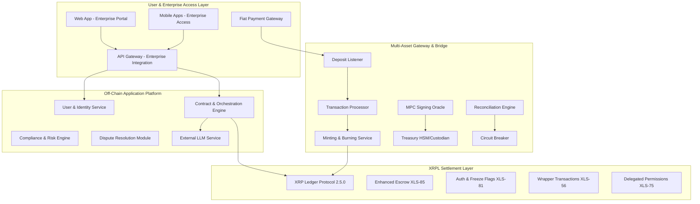

# Design Document

## Overview

The Smart Payment Infrastructure is an enterprise-grade B2B payment platform built on Ripple XRPL that eliminates trust deficits in cross-border transactions. The system leverages XRPL's native capabilities combined with AI-powered orchestration, multi-asset bridging, and abstracted user interfaces to create "Smart Cheques" - programmable, milestone-based payments that are secure, compliant, and automated.

The platform operates as a closed-loop, KYC-only ecosystem restricted to pre-authorized business entities, with all blockchain complexity hidden behind familiar enterprise interfaces that resemble traditional ERP and treasury management systems.

## Architecture

### High-Level System Architecture

The platform consists of four primary layers:



### Architectural Principles

- **Security by Design**: Zero-trust model with segregated components and quantum-resistant encryption
- **Compliance-First**: Meets RBI CBDC framework, AML/CFT, and multi-jurisdictional requirements
- **Enterprise Abstraction**: All blockchain operations hidden behind familiar business interfaces
- **Resilience**: Fault-tolerant design with AI-powered anomaly detection
- **Scalability**: Cloud-native microservices with auto-scaling capabilities

## Components and Interfaces

### 1. User & Enterprise Access Layer

**Purpose**: Primary interface for corporate users, abstracting all technical complexity

**Components**:
- **Web & Mobile Apps**: React 19.1.1 frontend with adaptive UIs for enterprise users
- **API Gateway**: Secure, rate-limited access for enterprise system integrations
- **Fiat Payment Gateway**: Manages corporate fund top-ups as familiar banking operations

**Key Interfaces**:
- RESTful APIs for enterprise system integration
- OAuth 2.0/OIDC for SSO with existing corporate identity systems
- Webhook endpoints for real-time transaction notifications

### 2. Off-Chain Application Platform

**Purpose**: Intelligent core handling business logic and AI orchestration

**Components**:

**User & Identity Service**:
- Corporate KYB/KYC verification and management
- Integration with CBDC eKYC for authorized representatives
- XRPL wallet auto-generation and management (hidden from users)

**Contract & Orchestration Engine**:
- AI-powered contract analysis using external LLMs (MiniCPM-Llama3-V2.5)
- Smart Cheque creation and milestone tracking
- Integration with third-party oracles (logistics, ERP systems)
- XRPL transaction orchestration using XLS-56 wrapper transactions

**Compliance & Risk Engine**:
- Real-time AML/CFT monitoring
- Multi-jurisdictional regulatory compliance
- Automated risk scoring and fraud detection
- Integration with XRPL freeze capabilities (XLS-81)

**Dispute Resolution Module**:
- Three-tier resolution system (AI → Stakeholder → Human arbitration)
- Integration with external mediation services
- Automated evidence collection and analysis

### 3. Multi-Asset Gateway & Bridge

**Purpose**: Enterprise-grade custodial system with defense-in-depth security

**Architecture Layers**:

**Hot Layer (Public Facing)**:
- Read-only deposit listeners for external chains
- No private keys, communicates via secure message queues

**Warm Layer (Business Logic)**:
- Transaction validation and processing
- Minting/burning of wrapped assets on XRPL
- Restricted-privilege key management

**Cold Layer (Maximum Security)**:
- HSM-secured treasury for enterprise funds
- Multi-Party Computation (MPC) signing oracle
- Geographically distributed 3-of-5 multi-signature scheme

**Watchtower Layer (Continuous Audit)**:
- Real-time reconciliation between on-chain and off-chain balances
- Automated circuit breakers for anomaly detection
- Independent monitoring system

### 4. XRPL Settlement Layer

**Purpose**: Secure, fast settlement engine using XRPL Protocol 2.5.0

**Key Features**:
- **Enhanced Escrow (XLS-85)**: Smart Cheque fund locking with conditional release
- **Wrapper Transactions (XLS-56)**: Efficient batching of multiple operations
- **Auth & Freeze Flags (XLS-81)**: Compliance enforcement and risk management
- **Delegated Permissions (XLS-75)**: Automated transaction execution for dispute resolution

## Data Models

### Core Business Entities

```typescript
interface Enterprise {
  id: string;
  legalName: string;
  jurisdiction: string;
  kybStatus: 'pending' | 'verified' | 'rejected';
  xrplWallet: string; // Hidden from UI
  authorizedRepresentatives: Representative[];
  complianceProfile: ComplianceProfile;
}

interface SmartCheque {
  id: string;
  payerId: string;
  payeeId: string;
  amount: number;
  currency: 'USDT' | 'e₹' | 'USDC';
  milestones: Milestone[];
  escrowAddress: string; // XRPL escrow
  status: 'created' | 'locked' | 'in_progress' | 'completed' | 'disputed';
  contractHash: string;
}

interface Milestone {
  id: string;
  description: string;
  amount: number;
  verificationMethod: 'oracle' | 'manual' | 'hybrid';
  oracleConfig?: OracleConfig;
  status: 'pending' | 'verified' | 'failed';
  completedAt?: Date;
}

interface Contract {
  id: string;
  parties: string[];
  obligations: Obligation[];
  paymentTerms: PaymentTerm[];
  disputeResolution: DisputeConfig;
  aiAnalysis: ContractAnalysis;
}
```

### XRPL Integration Models

```typescript
interface XRPLEscrow {
  account: string;
  destination: string;
  amount: string;
  condition?: string;
  fulfillment?: string;
  cancelAfter?: number;
  finishAfter?: number;
}

interface WrappedAsset {
  currency: string;
  issuer: string; // Gateway address
  totalSupply: number;
  reserveBalance: number; // Off-chain treasury
}
```

## Error Handling

### Multi-Layered Error Management

**1. Application Layer Errors**:
- Input validation and sanitization
- Business rule violations
- User-friendly error messages in business terms

**2. Integration Layer Errors**:
- Third-party API failures with fallback mechanisms
- Oracle data inconsistencies with manual override options
- LLM service timeouts with cached analysis fallbacks

**3. Blockchain Layer Errors**:
- XRPL transaction failures with automatic retry logic
- Network congestion handling with fee escalation
- Escrow condition failures with dispute escalation

**4. Security Layer Errors**:
- Fraud detection triggers with automatic transaction halting
- Compliance violations with immediate freeze capabilities
- Custody failures with emergency circuit breaker activation

### Error Recovery Strategies

```typescript
interface ErrorRecoveryConfig {
  retryPolicy: {
    maxAttempts: number;
    backoffStrategy: 'exponential' | 'linear';
    retryableErrors: string[];
  };
  fallbackMechanisms: {
    oracleFailure: 'manual_verification' | 'cached_data' | 'dispute_escalation';
    xrplFailure: 'queue_retry' | 'alternative_path' | 'manual_intervention';
    complianceFailure: 'freeze_account' | 'escalate_review' | 'reject_transaction';
  };
  alerting: {
    channels: ('email' | 'slack' | 'webhook')[];
    severity: 'low' | 'medium' | 'high' | 'critical';
    escalationPath: string[];
  };
}
```

## Testing Strategy

### 1. Unit Testing
- **Coverage Target**: 90%+ for critical business logic
- **Framework**: Go testing package with testify for assertions
- **Focus Areas**: Contract parsing, milestone validation, compliance checks

### 2. Integration Testing
- **XRPL Testnet Integration**: Full end-to-end Smart Cheque workflows
- **Third-party API Mocking**: Logistics, ERP, and oracle service simulations
- **Database Integration**: PostgreSQL and MongoDB transaction testing

### 3. Security Testing
- **Penetration Testing**: Quarterly VAPT assessments
- **Smart Contract Audits**: XRPL Hooks security reviews
- **Custody Security**: HSM and MPC implementation validation

### 4. Performance Testing
- **Load Testing**: 10,000+ concurrent enterprise users
- **Stress Testing**: Peak transaction volumes during business hours
- **Scalability Testing**: Auto-scaling validation under varying loads

### 5. Compliance Testing
- **Regulatory Simulation**: Multi-jurisdictional compliance scenarios
- **AML/CFT Testing**: Suspicious transaction pattern detection
- **Data Privacy**: GDPR and DPDPA compliance validation

### 6. User Acceptance Testing
- **Enterprise User Journeys**: Complete business workflow validation
- **UI/UX Testing**: Blockchain abstraction effectiveness
- **Integration Testing**: ERP and existing system compatibility

## Technology Stack

| Layer | Component | Technology |
|-------|-----------|------------|
| Frontend | Web & Mobile | React 19.1.1, Swift 6.1.2, Kotlin 2.2.0 |
| Backend | Microservices | Go 1.24.6 |
| Database | Off-Chain Storage | PostgreSQL 17.5, MongoDB 8.0.12 |
| Messaging | Queues | AWS SQS, Google Cloud Pub/Sub |
| Blockchain | Settlement | XRP Ledger Protocol 2.5.0 |
| Cloud | Infrastructure | AWS EKS 1.33.2, Docker 28.3.3, Terraform 1.11.3 |
| Security | Key Management | Fireblocks/ZenGo + AWS KMS |
| AI/ML | Contract Analysis | MiniCPM-Llama3-V2.5 |

## Security Considerations

### 1. Custody Security
- **Multi-signature**: 3-of-5 geographically distributed signing
- **HSM Integration**: Hardware security modules for key storage
- **Cold Storage**: Majority of funds in offline, air-gapped systems

### 2. Application Security
- **Zero Trust Architecture**: All components authenticate and authorize
- **Encryption**: End-to-end encryption for all sensitive data
- **API Security**: Rate limiting, input validation, and OAuth 2.0

### 3. Compliance Security
- **Data Privacy**: GDPR and DPDPA compliant data handling
- **Audit Trails**: Immutable transaction logs on XRPL
- **Regulatory Reporting**: Automated compliance report generation

### 4. Operational Security
- **Monitoring**: 24/7 SOC with AI-powered anomaly detection
- **Incident Response**: Automated circuit breakers and manual overrides
- **Business Continuity**: Multi-region deployment with disaster recovery